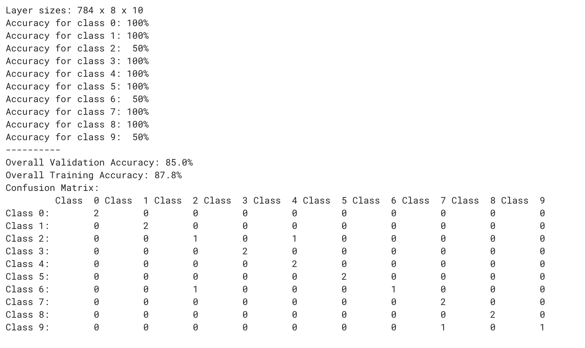

# Fashion-MNIST Classifier

A machine learning project that uses a neural network to classify clothing images from the Fashion-MNIST dataset.

## Demo

[View the project on Girls Who Code TextJam](https://hq.girlswhocode.com/TextJam/py/22321/2366f398)

## How I Made It

- **Language:** Python
- **Libraries:** Pandas, scikit-learn
- **Model:** MLP (neural network)
- **Dataset:** Fashion-MNIST

I built this project through Girls Who Code Pathways. I used the provided dataset and worked with the starter project to build and test the neural network.

## What I Learned

I learned how to:
- Prepare and normalize data
- Train a neural network with scikit-learn
- Test a model using validation data
- Read accuracy results and a confusion matrix

## What I Struggled With

One of the harder parts was understanding how to evaluate the model and interpret the confusion matrix. I also had to figure out how to split the data into training and validation sets.
